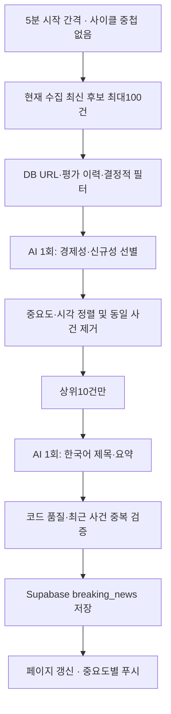

# OpenRouter 요청량 조사 — 2026-09-13

> **최신 운영 기준:** 이전 900회·영속 pending·AI 품질보정 설계는 [단순 두 단계 뉴스 SPEC](superpowers/specs/2026-09-13-simple-two-stage-news-design.md)으로 대체되었다. 아래의 이전 수치는 조사 당시 구조를 설명하는 역사적 기록이며, 현재 운영 수치는 “최신 구조” 절에서 확인한다.

## 확인 범위
로컬 저장소 HEAD 기준 조사. 운영 서버/PM2, 계정 대시보드, 원격 환경은 접근하지 않았다. 로컬 `.env`는 변수 이름만 추출해 확인했으며 OpenRouter 키 변수는 있으나 GNews/모델 override 변수는 없었다. 값은 출력하지 않았다. 서버 설정이 같다는 뜻은 아니다. `kospi-night` 비사용은 사용자 제공 정보이며 이 저장소에서 해당 서비스 구현을 검증하지 않았다.

## 변경 전 서비스 파이프라인

현재 AI는 선별과 요약을 두 요청으로 분리한다. 두 단계가 공유하는 추가 재시도는 회차당 최대1회이며, 별도 JSON 복구·품질보정·영속 pending은 사용하지 않는다. 수집·결정적 필터·원문 정규화·숫자 및 문장 검증·DB 저장·페이지 갱신·푸시는 AI가 아니다. DB 최근 기사는 최대300건 규칙 비교, AI 문맥은 최신100건이다. 프론트엔드 자체 렌더링은 이 저장소 밖이며 이 저장소는 `/live`, `/` 갱신을 요청한다.

## 실제 OpenRouter 경로
| 진입점 | AI 사용 | 모델 / HTTP 재시도 |
|---|---|---|
| `gnews_tracker.py` 운영 | `run_two_stage_pipeline` → stage generator → `safe_generate_content` | GNews 주/백업 모두 무료 모델, 단계당 1회 및 공통 재시도 1회, 60초 timeout |
| `gnews_tracker.py --dry-run` | 운영과 같은 두 단계 pipeline | 실제 API 사용. DB/푸시만 생략 |
| `breaking_tracker.py` 롤백용 | 제목 선별 Pass1 → 본문 심층 분석 Pass2 | 일반 OPENROUTER 모델 환경변수, 기본 주/백업 모두 무료. helper 기본 총10번 시도 |
| `test.py` 수동 스크립트 | helper에 테스트 프롬프트 | 실제 API 사용, 기본 총10번 시도 |
| `exchange_tracker.py` | 없음 | OpenRouter 호출 없음 |

HTTP POST 구현은 `llm_helper.py` 한 곳이다. 첫2번은 주 모델, 이후 백업이다. GNews는 `require_parameters=True`, `allow_fallbacks=True`와 JSON schema를 전달한다. provider fallback은 OpenRouter 내부 동작으로, 이 저장소의 HTTP 요청 횟수와 내부 provider 시도 수를 혼동하지 않는다. 로컬 코드로 서버 내부 시도 수는 계산할 수 없다.

`openrouter/free`는 요청 기능을 지원하는 무료 모델 중 선택하므로 고정 모델이 아니다. 같은 이름으로 재시도해도 계정 일일 한도는 늘지 않는다. [공식 무료 라우터 문서](https://openrouter.ai/docs/guides/routing/routers/free-router)

## 이전 구조 요청 계산 (historical)
5분 사이클이 300초 이내 완료되고 UTC 하루 동안288회, 수집실패·재시작이 없다고 가정한다.

- GNews 수집: 144회×4 + 144회×1 = **720 HTTP/일**, 수집 재시도 제외. `GNEWS_DAILY_SAFETY_LIMIT=950`은 이 API만 제한한다.
- 후보 전량 신규/규칙통과, 보류없음: 144×ceil(100/10) + 144×ceil(25/10) = **1,872 기본 AI HTTP/일**.
- 936은 현재 기본 배치10과 불일치한다. 배치20을 두 단계 모두에 적용하면 144×(5+2)=1,008이므로 그것만으로도1,000을 초과한다. 외부 배치만 올리면 내부 selector가 여전히10개씩 나눈다.
- 실제 기본 호출 수는 외부 fresh/품질재처리 각 배치 안에서 규칙통과 후보 수를 K라 할 때 Σceil(K/10)이다. 빈 배치는0이며 외부 배치 간 남는 자리는 합쳐지지 않는다.
- 내부 배치당 generator: 선별1 + JSON복구1 + 재선별1 + JSON복구1 + 품질보정1 = **최대5**. 각각 HTTP최대3 → **최대15**.
- 지속 HTTP429: helper3번 실패 → None → selector ValueError → 선별재실행 → helper3번 = **6 HTTP/내부배치**. JSON복구 경로까지 도달하지 않는다.
- 실패 기사·DB 실패 기사도 보류된다. 일반 AI 실패 보류에는 횟수/크기 상한이 없어 다음 회차 요청 후보가 늘어날 수 있다. 평가 캐시는 메모리5000 URL이며 재시작 때 초기화된다.
- 사이클이 길어지면 다음 사이클은 이전 완료 후 시작한다. 아래 큰 수치는 처리 지연을 무시한 부하 시나리오이지 관측된 서버 하루 사용량이 아니다.

| 조건 | 이전 구조 HTTP/일 |
|---|---:|
| best: 새 AI 후보 없음 | 0 |
| 실측 average | 서버 요청 로그 없으므로 산출 불가 |
| 가정 예시: 매회 내부배치2개, HTTP 첫시도 성공, 배치20%에 보정1회 | 약691 (576×1.2) |
| 모든 수집 후보 신규, 기본 응답 정상 | 1,872 |
| 위 후보량에 모든 배치가 최대 복구·재시도 경로 | 28,080 (1,872×15) |
| 위에 매회 품질 재처리10건 추가, 모두 최대 경로 | 32,400 ((1,872+288)×15) |
| 누적 AI/DB 실패 보류까지 포함한 코드 자체 worst | 고정 일일 요청 상한 없음 |

## 원인 분리
1. 사용자 로그 `free-models-per-day-high-balance`와 `limit_source=openrouter_free_tier_daily`는 일일 무료 요청 소진을 가리킨다. Remaining0 단독으로는 분당/일일을 구별할 수 없다.
2. 변경 전 코드만으로도 기본 후보 전량 처리량은1,000을 초과할 수 있다. 중복률·보정률·재시도가 실제 소진 시점을 결정한다.
3. 기존429 재시도는 한도 소진 뒤에도 요청을 낭비한다. 백업도 같은 무료 라우터라 회복되지 않는다.
4. 구 RSS 작업/수동 스크립트/다른 호스트가 동일 계정을 썼는지는 미확인이다. 코드에 경로가 있다는 사실이 동시 실행 증거는 아니다.
5. 새 키의 $1 금액 제한은 요청 횟수 제한과 별개다. 정책이 최근 바뀌었다는 증거는 없다. 공식 문서는 무료 한도50 또는1,000, 실패 시도도 한도에 포함될 수 있다고 안내한다. [한도 문서](https://openrouter.ai/docs/api_reference/limits), [공식 지원 안내](https://openrouter.zendesk.com/hc/en-us/articles/39501163636379-OpenRouter-Rate-Limits-What-You-Need-to-Know)

## 최신 구조 요청 계산
5분 간격으로 UTC 하루 288회가 실행되고, 현재 수집 후보가 있으며 두 단계가 모두 성공한다고 가정한다.

- 정상: 선별1 + 요약1 = **576 HTTP/일**.
- 공통 재시도 1회를 매회 사용하는 worst: 3 × 288 = **864 HTTP/일**.
- 후보 없음: **0 HTTP/일**. 선택 결과가 비어도 선별 1회이므로 **1 HTTP/회차**다.
- 기본 무료 예산은 **990회/UTC일**이며, 기존 SQLite 슬롯 분배·429 차단이 모든 무료 helper 호출에 적용된다. GNews의 주/백업 모델은 모두 무료만 허용한다.

990회는 생성 성공 횟수나 발행 기사 수가 아니라 재시도를 포함한 무료 HTTP 시도 상한이다. 실제 후보 수·응답 실패·다른 helper 사용량은 달라질 수 있다.

## 최종 서비스 흐름과 방향
현재 수집 → 규칙 필터/저장 URL 제외 → AI 선별(최대100개) → 중요도·최신순 정렬/사건 중복 제거 → 상위10개 AI 요약 → 기존 품질·사건 중복 검사 → DB 저장/알림.

무료 모델만 사용한다. 공통 추가 시도는 한 번이며 별도 JSON 복구·품질 보정 호출은 없다. 출력 한도는 선별/요약 각각 기본8192토큰이다. 모델 자체 한도와 실제 품질/응답시간은 별도다.

실패·우선순위 컷·DB 저장 실패는 완료 표시하지 않는다. 영속 기사 대기열은 없으며 다음 수집에 다시 등장할 때만 재평가한다. 정상 탈락은 메모리 평가 캐시에 기록한다. 앞으로는 무료 모델의 실제 요약 품질과 지연을 측정하고, 원문 대비 숫자·주체·중요도 회귀 사례를 축적하는 것이 우선이다.

실측 평균은 운영 요청 로그가 없어 알 수 없다. 매회 요약할 기사가 있고 오류가 없는 정상 시나리오는576회, 모든 회차에서 추가 시도를 사용하는 최악은864회다. 무료 서비스 가용성과 모든 중요 기사의 재수집/발행을 보장하지는 않는다.

## 남은 위험
- 공유 키가 다른 호스트/다른 예산 파일에서 쓰이면 그 사용량은 합산하지 못한다. 같은 파일을 쓰는 로컬 프로세스만 공동 제한한다.
- 이미 소진된 날 새 로컬 DB를 도입해도 이전 원격 사용량을 알 수 없다. 예산 파일 삭제/경로 변경도 이력을 초기화한다.
- 기본990 설정은 계정의 실제 무료 등급보다 높을 수 있으므로 계정 등급에 맞는 설정이 필요하다.
- 무료 모델 품질/가용성·upstream 제한·API 리셋 시각 차이는 남는다. 일일429는 보수적으로 다음UTC자정과 유효한 서버 재시도 시각 중 늦은 시점까지 멈춘다.
- 미사용 슬롯 예산 미이월로 실제 사용량이990보다 낮아질 수 있다. 무료 처리량이 모자라면 현재 회차는 다음 수집에서 다시 평가된다.
- 이번 작업은 로컬 수정/모킹 검증만 수행한다. 서버 배포·PM2 재시작·실제 API 검증은 하지 않는다.

## 검증 근거
- 변경 전 전체185개 테스트 통과. 변경 전 HEAD 모킹 재현에서 내부배치 정상1회, 최대 복구/재시도15회, 지속429 6회 확인.
- 최종 전체 `tests/` **210개 통과**. 실제 외부 HTTP/DB/알림 호출 없이 검증했다.
- 실제 HTTP 함수 `requests.post`를 모킹하고 단계별 schema/토큰 전달, 정상2회·공통 재시도 최대3회, 잘린 응답, 실패 후 재수집/DB 실패 미평가를 검증했다.
- root 독립 부하 검증: 실제 임시 SQLite 예산과 매5분 변경하는 시계로288회차를 실행했다. 매회 잘못된 응답→선별 성공→요약 성공을 반복해 **864 POST, 288 유효 요약**을 확인했다.
- root 독립429 검증: 일일429 최초1 POST 후, 같은 예산 파일로 새 generator/예산 객체를 만들어도 다음 실행은0 POST. 차단 상태 영속성 확인.
- 기존 예산 테스트로 동시 예약·일자 전환·예산 저장 실패 시 차단·임시429를 검증한다.
- 최종 리뷰에서 요약 전 상위10개 제한 이전 사건 중복 제거와 운영/dry-run 공통 필터를 확인했다. 요약 후 기존 중복 검사도 유지한다.
- 문법 검사·diff 검사·비밀 값 검사를 수행한 후 사용자 요청에 따라 커밋/일반 push한다. 서버 배포·PM2 재시작은 범위 밖이다.

## 변경 파일
| 파일 | 내용 |
|---|---|
| `news_pipeline.py` | 선별/요약 분리, 중요도·최신순 상위10개, 공통 추가시도1회 |
| `gnews_tracker.py` | 운영/dry-run 새 흐름, 무료 모델/단계별 토큰 설정, 현재 수집만 처리 |
| `llm_helper.py` | HTTP 직전 예산 예약,429 즉시 차단, 토큰/잘림 정보 전달 |
| `openrouter_budget.py` | SQLite 일일990회/슬롯 예산과 영속429 차단 |
| `news_selector.py` | 레거시 경로의 예산 예외와 부분 결과 처리 |
| `tests/test_news_pipeline.py`, `tests/test_openrouter_budget.py` | 신규 파이프라인/예산 테스트 |
| 관련 기존 테스트4개 | 설정·worker·helper·legacy selector 회귀 검사 |
| `.gitignore` | 예산 DB/WAL/SHM 제외 |
| `readme.md`, 조사보고서, SPEC/계획 | 최종 동작과 검증 기록 |
